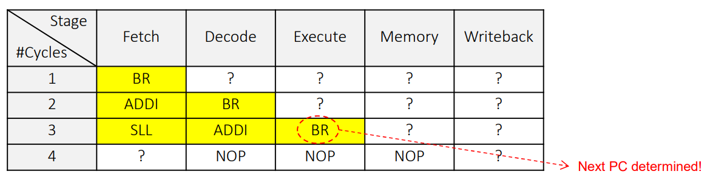

# HW2
## Branch Predictor Design
### HW Goal
* This homework requires you to modify the Branch
Prediction Unit (BPU) of Aquila to improve CoreMark
    * Analyze the current BPU first
    * Design a two-level predictor to improve the performance

### Types of Branches

* Conditional forward jumps: for if-then-else statements
* Conditional backward jumps: used in looping statements
* Unconditional jumps: for function calls, or from bad coding


### Dependencies of Fetch on Execute
* In a 5-stage pipeline, a branch instruction, after Fetch, may take up to two cycles to determined the next PC
    * The Execute is responsible for calculating the branch condition and update the PC
    * Do we have to stall the Fetch stage for the next instruction by two cycles?
* A branch predictor predicts the PC before Execute computes the condition expression
    * If the prediction is wrong, the pipeline has to be flushed before the Memory stage!

### Static Branch Prediction
* Static branch prediction always make the same decision (forward/ ackward x taken/not taken)
* Implementation can be done by one of three methods
    * Hardwired into the processor pipeline
        * Assuming branch always taken, the Fetch must do a quick decode of the target PC
        * Assuming branch always not taken, then the PC PC + 4
    * Compilers generate the hint bit if the ISA supports it
    * Cooperation between the processor and the compiler, by following some register usage convention. For example, 
        1.  ```bne s1, s3, 318``` suggests taken
        2.  ```bne s1, s4, 318``` suggests not taken

### Dynamic Branch Prediction
* The processor collects statistics at runtime of whether every branch instructions are taken or not

* The fetch unit fetches the predicted next instruction 
* In the case of a misprediction, the pipeline has to be flushed to re-fetch the correct instruction
    * The penalty is high for a misprediction
    * The CPU states has not been changed upon misprediction
    
    