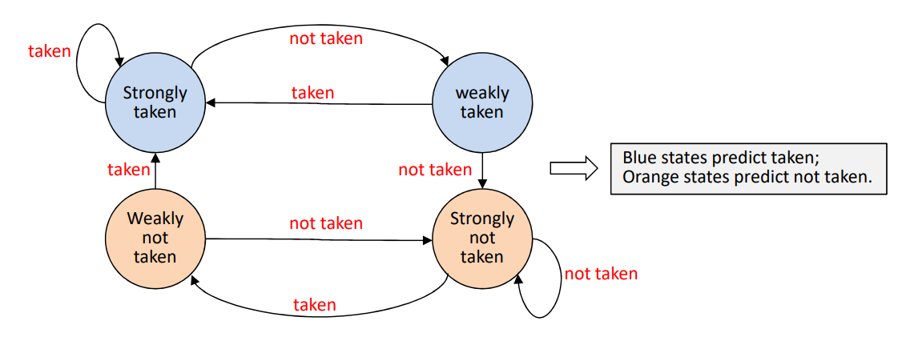

# HW2
## Branch Predictor Design
### HW Goal
* This homework requires you to modify the Branch
Prediction Unit (BPU) of Aquila to improve CoreMark
    * Analyze the current BPU first
    * Design a two-level predictor to improve the performance

### Types of Branches

* Conditional forward jumps: for if-then-else statements
* Conditional backward jumps: used in looping statements
* Unconditional jumps: for function calls, or from bad coding


### Dependencies of Fetch on Execute
* In a 5-stage pipeline, a branch instruction, after Fetch, may take up to two cycles to determined the next PC
    * The Execute is responsible for calculating the branch condition and update the PC
    * Do we have to stall the Fetch stage for the next instruction by two cycles?
* A branch predictor predicts the PC before Execute computes the condition expression
    * If the prediction is wrong, the pipeline has to be flushed before the Memory stage!

### Static Branch Prediction
* Static branch prediction always make the same decision (forward/ ackward x taken/not taken)
* Implementation can be done by one of three methods
    * Hardwired into the processor pipeline
        * Assuming branch always taken, the Fetch must do a quick decode of the target PC
        * Assuming branch always not taken, then the PC PC + 4
    * Compilers generate the hint bit if the ISA supports it
    * Cooperation between the processor and the compiler, by following some register usage convention. For example, 
        1.  ```bne s1, s3, 318``` suggests taken
        2.  ```bne s1, s4, 318``` suggests not taken

### Dynamic Branch Prediction
* The processor collects statistics at runtime of whether every branch instructions are taken or not

* The fetch unit fetches the predicted next instruction 
* In the case of a misprediction, the pipeline has to be flushed to re-fetch the correct instruction
    * The penalty is high for a misprediction
    * The CPU states has not been changed upon misprediction
    

### Branch Prediction Schemes
* One-level Predictor
    * Uses a Branch History Table(BHT) indexed by the recent branch addresses
    * When the fetch unit reaches a branch location, it gets the PC for the next instruction to fetch based on the BHT
    * One-level predictor is based on bimodal assumption:
        * The branch at a specific PC is either taken or non-taken most of the time
        * For one-level branch predictor, we must determine:
            1. How many address bits are used to index the BHT
            2. How many bits are used to record the  branch statistics
            3. How many branch instructions are recorded in the BHT
        

    * Aquila implements the simple 2-bit predictor
        * For each branch instruction, we record its branch likelihood
with one of four possible states:
        * The state changes after the execute stage determines whether the branch is taken or not.
        

* BHT Implementation
    * The BHT is an associative memory
        * Data are retrieved using a TAG, instead of address
        * For BHT, TAG is the PC of the current branch instruction
    
    * Theoretically, the BHT size should be large enough to accommodate all branch instructions in the program
    
    * In Aquila, BHT size is specified by the parameter ENTRY_NUM in bpu.v
        * However, to actually change its size, you have to modify part of the Verilog code as well as the parameter.


* Two-level Adaptive Branch Prediction
    * MCFarling’s Two-Level Prediction (gshare, 1993).
    * Call-stack predictor for unction call returns
    * A branch depends on the branch address as well as:
        * Nearby branches – recorded using Global Branch History
        * Longer history of the same branch – Local Branch History
        

    * gshare: XOR address & history into the index bits
        * k-bit for global history would be a waste of registers
        * Global history and branch address can share the index bits using XOR operations
        

    * Different predictors work for different code patterns
        * Multiple predictors can be used to adapt to different code sections in the program:
        

### To Do
* Part 1: Analysis report :
    * Study the branch predictor in Aquila
        * Disable BPU or reduce BHT size see what happens to CoreMark
    * Analyze the branch statistics (eg. hit rate and miss rate for
different types of branches) of CoreMark
    * Based on your analysis, discuss your plan on how to use a
two-level predictor to improve the performance
    * You report on this part should be no more than two pages.

* Part 2: Two-level predictor 
    * Try out some ideas on two-level predictors
    * Extend your analysis report to include new results and new discussions. The overall report size should be no more than three pages.